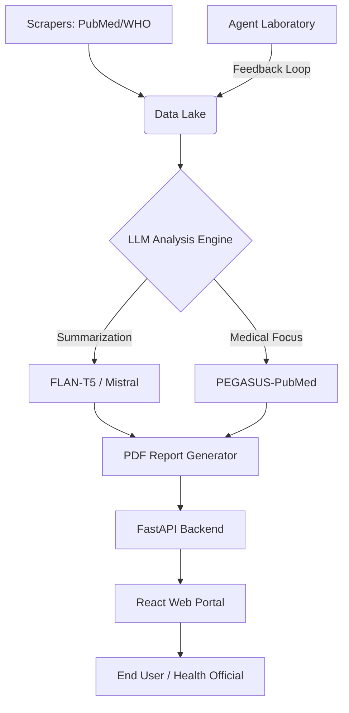

# 🚀 Research & Medical Intelligence Suite (RMIS)
## *From Data Scraping to Autonomous Research & Professional Reporting*

[](https://www.python.org/)
[](https://fastapi.tiangolo.com/)
[](https://reactjs.org/)
[](https://huggingface.co/)
[](https://opensource.org/licenses/MIT)

---

## 🌟 Vision
The **Research & Medical Intelligence Suite (RMIS)** is an end-to-end ecosystem designed to bridge the gap between raw scientific data and actionable medical intelligence. By combining **Autonomous LLM Agents**, **High-Precision Web Scrapers**, and a **Modern Web Portal**, RMIS empowers researchers, medical professionals, and stakeholders to stay ahead of the curve in a rapidly evolving scientific landscape.

---

## 💼 Executive Summary: The Business Value
In an era where thousands of medical papers are published daily, "information overload" is a critical bottleneck. RMIS solves this by:
- **Reducing Research Time by 80%**: Automating literature reviews and experimentation plans.
- **Ensuring Real-time Intelligence**: Daily automated updates from PubMed, WHO, and ClinicalTrials.gov.
- **Universal Accessibility**: Delivering complex analyses via a simplified QR-code-based mobile portal for health officials.
- **Strategic ROI**: Minimizing manual documentation costs and accelerating the discovery-to-implementation pipeline.

---

## 🏛️ Core Pillars

### 1. 🧪 Agent Laboratory (The Researcher)
An autonomous research workflow that mimics a high-functioning lab.
- **Phases**: Literature Review → Plan Formulation → Experimentation → Report Writing.
- **Persona-Driven Agents**: PhD Students, Postdocs, and Professors collaborate to refine ideas.
- **Tool Integration**: Direct access to arXiv, Hugging Face, and Python execution environments.

### 2. 🔍 Research Analyzer (The Intelligence)
The data-crunching engine that powers the suite.
- **Multi-Source Scrapers**: Specialized modules for PubMed, MedRxiv, ClinicalTrials.gov, and OATD.
- **LLM Pipeline**: Utilizes Hugging Face's inference API with models like FLAN-T5, Mistral, and specialized medical/academic models (PEGASUS-PubMed).
- **Automated Reporting**: Generates professional PDF reports with statistical visualizations using `fpdf2` and `matplotlib`.

### 3. 🌐 Medical QR Portal (The Delivery)
A production-ready full-stack application for distributing intelligence.
- **Backend (FastAPI)**: Serves reports and metadata with high performance.
- **Frontend (React/Tailwind)**: A sleek, RTL-supported (Arabic) interface designed for regional health ministries.
- **QR System**: Dynamic QR code generation for instant access to the latest daily reports without re-printing.

---

## 🛠️ Technical Architecture



---

## 📂 Project Structure

```text
├── agent_laboratory/       # Autonomous LLM research assistants
├── research_analyzer/      # Core analysis, scrapers, and local web app
│   ├── core/               # LLM & Paper Analysis logic
│   ├── scrapers/           # Medical & Thesis web scrapers
│   ├── web/                # Local Flask-based report dashboard
│   └── scheduler.py        # Automated daily task runner
├── backend/                # Production FastAPI server
├── frontend/               # Production React web portal
├── Website-Clone/          # High-precision scraping & cloning utility
├── report_generator.py     # Main PDF generation engine
└── app_size_analyzer.py    # System utility for deployment optimization
```

---

## 🚀 Getting Started

### Prerequisites
- Python 3.10+
- Node.js & npm (for Frontend)
- Hugging Face API Key (for Analysis)
- OpenAI/DeepSeek API Key (for Agent Laboratory)

### 1. Environment Setup
```bash
# Clone the repository
git clone <repo-url>
cd research-intelligence-suite

# Install Python dependencies
pip install -r requirements.txt
```

### 2. Configuration
Create a `.env` file in the root directory:
```env
HF_API_KEY=your_huggingface_key
OPENAI_API_KEY=your_openai_key
REACT_APP_API_URL=http://localhost:5000
```

### 3. Running the Suite
**For Development (Local Servers):**
```bash
# Run the automated server starter
run_servers.bat
```

**For Production Deployment:**
```bash
# Run the deployment script
deploy.bat
```

---

## 🔬 Deep Dive: Module Highlights

### 📊 Research Analyzer
- **Smart Categorization**: Automatically classifies papers into "Treatment", "Diagnostics", "Public Health", etc.
- **Robust Scrapers**: Includes retry mechanisms and fake-useragent rotation to ensure high availability.
- **Arabic Support**: Specialized T5 and BERT models for Arabic medical text processing.

### 🤖 Agent Laboratory
- **MLESolver**: Optimized for Machine Learning experimentation.
- **PaperSolver**: Specialized in synthesizing research into LaTeX/PDF format.
- **Human-in-the-Loop**: Optional "Co-Pilot" mode for interactive research guidance.

### 📋 Website Clone Utility
- **Dynamic Content**: Uses Selenium to handle JavaScript-heavy sites.
- **Full Asset Capture**: Downloads images and styles while preserving structure.
- **Structure**: Perfect for creating local mirrors of research repositories.

---

## 📈 Impact & ROI
- **For Governments**: Immediate dissemination of global medical breakthroughs to local clinics.
- **For Researchers**: Automating the "grunt work" of literature reviews to focus on core innovation.
- **For Developers**: Highly modular architecture allowing easy integration of new LLMs or data sources.

---

## 📜 License
This project is licensed under the **MIT License**. See [LICENSE](LICENSE) for details.

---

## 📬 Contact
**Project Lead**: [Your Name/Email]
**Inquiries**: [Business/Technical Support Email]

---
*Created with ❤️ for the Advancement of Science and Public Health.*
